# Kart Party

Un juego de karts para jugar en el sillón, de 1 a 4 jugadores, hecho en Unity 6, donde **cada jugador usa su celular como control**. No hay que instalar ninguna app: los celulares escanean un código QR y se abre un control táctil en el navegador. Tiene cuatro pistas, y los lugares vacíos de la parrilla se pueden llenar con corredores de la computadora (o no: también se puede jugar 1 contra 1 o contrarreloj en solitario).

### [⬇️ Descargar para Windows](https://github.com/srhanscho/kart-test/releases/latest/download/KartParty-Windows.zip)

Descomprime el `.zip`, abre `KartParty/KartParty.exe` y escanea el QR con tu celular. Todas las versiones están en [Releases](https://github.com/srhanscho/kart-test/releases).

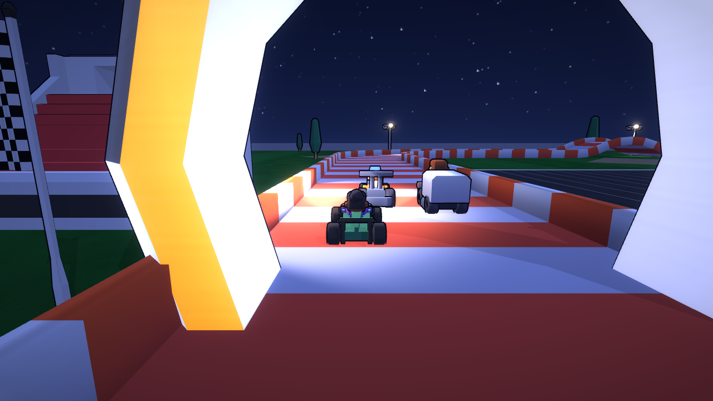

## Características

| Área | Qué incluye |
|------|-------------|
| **Control con el celular** | Escanea el QR en la pantalla de la PC y se abre un control táctil horizontal en el navegador del celular. Funciona con un pequeño servidor WebSocket dentro del juego, por la red Wi-Fi local. Hasta 4 jugadores, con vibración. |
| **Pantalla dividida** | De 1 a 4 jugadores (pantalla completa, arriba/abajo o cuadrantes), cada uno con su propia cámara y HUD. |
| **Corredores de la computadora** | Apagados, 2, 4 o completar hasta 6 karts (se elige en el lobby). Siguen la trazada, esquivan obstáculos, usan ítems y ayudan un poco a que la carrera se mantenga pareja. |
| **12 personajes** | Cada piloto va en su propio kart y tiene velocidad, aceleración y manejo ligeramente distintos. |
| **Ítems** | Cajas de ítems con ruleta: cáscara de banana, turbo, cohete teledirigido y escudo. Mientras más atrás vas, mejores ítems te tocan. |
| **Manejo** | Estilo arcade, derrape con mini-turbo, salto, trompos al chocar y un ayudante de rescate que te devuelve a la pista. |
| **Pistas** | **Night Circuit** (809 m, circuito de juguete iluminado con una subida), **Sunset Grand Prix** (1164 m, asfalto ancho y rápido con boxes y gradas al atardecer), **Toy Box Hills** (838 m, pista naranja de dos pisos con lomas que te hacen volar) y **Neon Night Loop** (805 m, angosta y técnica con bloques de neón que se mueven). Se eligen en el lobby, o en modo RANDOM. |
| **Líder de la partida** | El jugador con el número más bajo es el líder: elige la pista y los corredores de la computadora, inicia la carrera, pausa (continuar / reiniciar / volver al lobby / salir) y puede cerrar el juego desde el lobby. El teclado de la PC siempre tiene estos permisos también. |
| **Presentación** | Intro animada con el logo al abrir el juego y un sobrevuelo de cámara por la pista antes de cada carrera, al estilo Mario Kart (ambos se pueden saltar). |
| **Imagen y sonido** | Sombreado tipo caricatura con bordes, brillo (bloom), sonido de motor generado por código y música chiptune (que se acelera en la última vuelta). |

## Pistas

| Night Circuit | Sunset Grand Prix |
|---------------|-------------------|
| 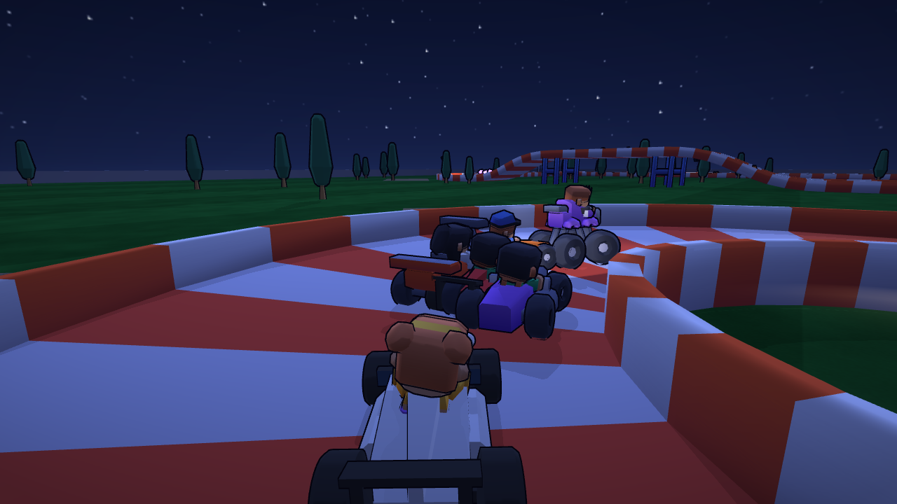 | 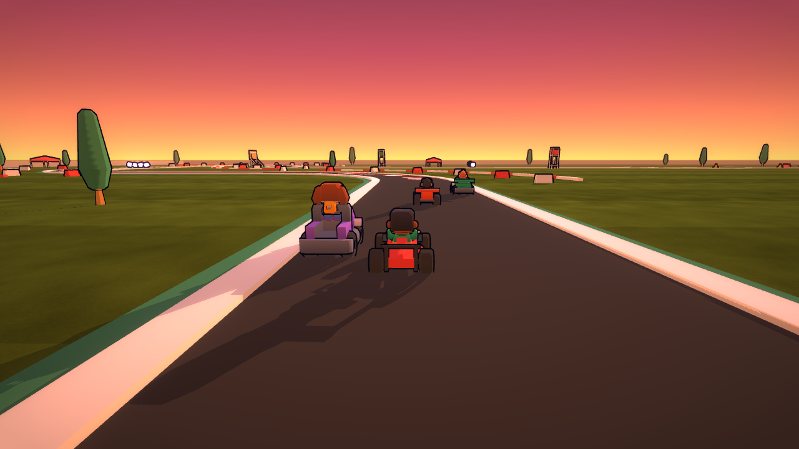 |

| Toy Box Hills | Neon Night Loop |
|---------------|-----------------|
| 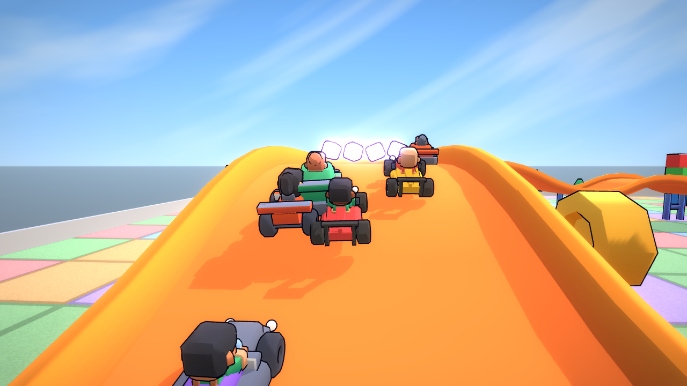 | 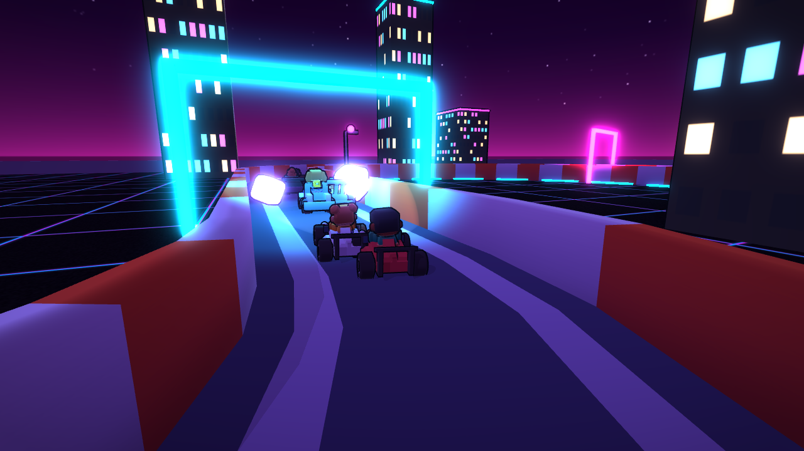 |

## Capturas

| Lobby con selector de pista | Pantalla dividida para 2 jugadores |
|-----------------------------|------------------------------------|
| 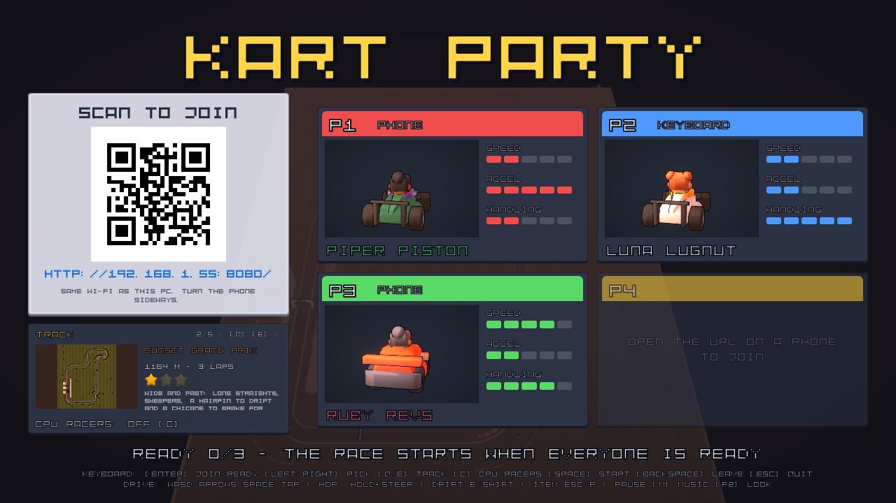 | 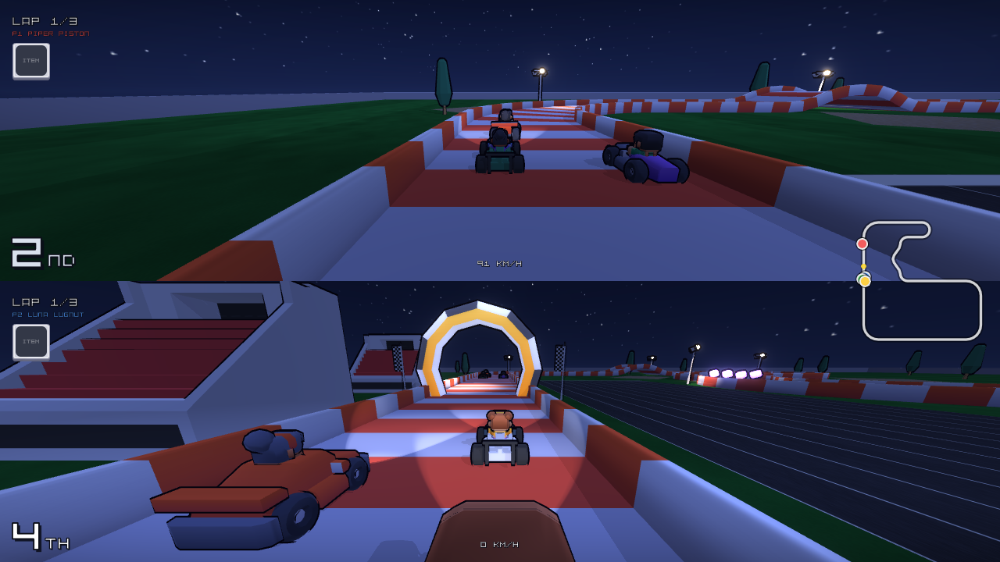 |

| Pantalla dividida para 4 jugadores | Podio de resultados |
|------------------------------------|---------------------|
| 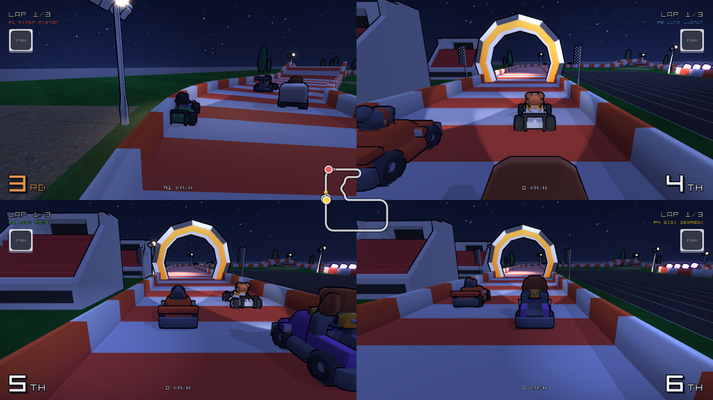 | 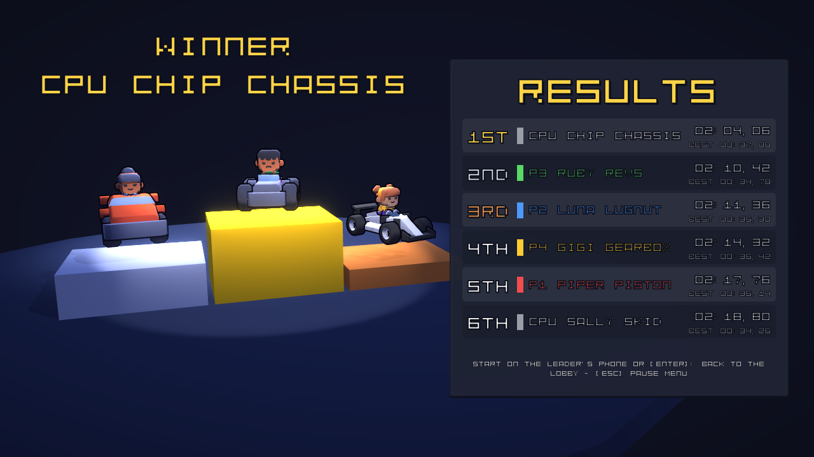 |

| Intro al abrir el juego | Menú de pausa |
|-------------------------|---------------|
| 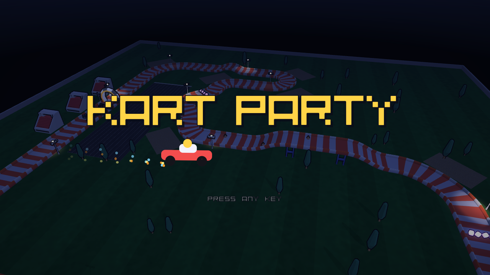 | 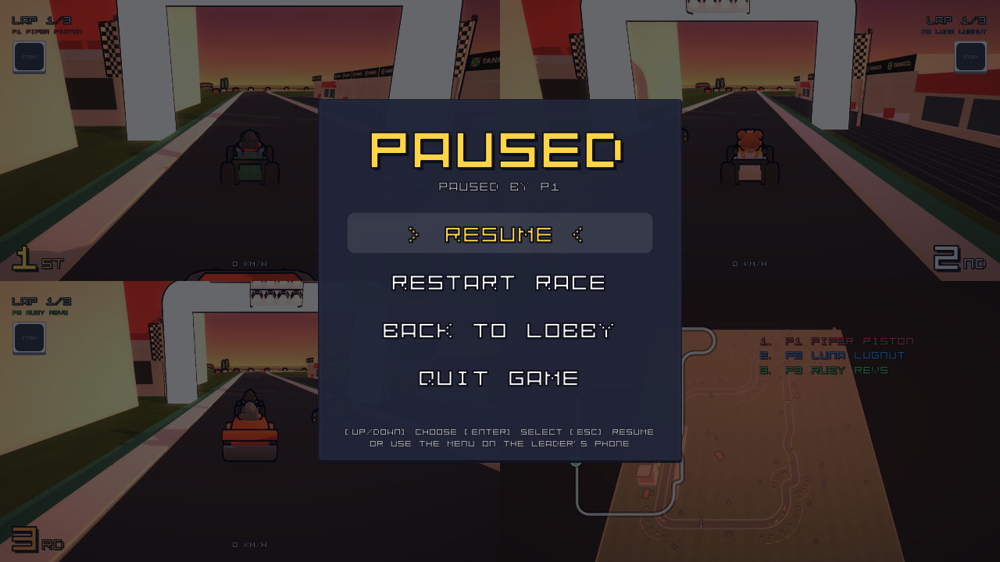 |

## Inicio rápido

**Requisitos:** Windows 10/11, [Unity 6000.6.3f1](https://unity.com/releases/editor/archive) y celulares conectados a la **misma red Wi-Fi** que la PC.

1. Clona el repositorio y abre la carpeta desde Unity Hub (**Add → Add project from disk**). La primera importación tarda unos minutos.
2. Abre `Assets/Scenes/Race.unity` y presiona **Play**.
3. Si el Firewall de Windows pregunta por Unity Editor, permite las **redes privadas**.
4. En cada celular, escanea el QR (o escribe la dirección que aparece en pantalla), elige un personaje y toca **READY**.
5. La carrera empieza cuando todos están listos.

> ¿No tienes celular a mano? Presiona **Enter** para unirte con el teclado.

## Controles

### Celular (en horizontal)

| Pulgar izquierdo | Pulgar derecho |
|------------------|----------------|
| ◀ ▶ girar | **GAS** (acelerar), **BRAKE** (frenar), **HOP/DRIFT** (tocar para saltar, mantener mientras giras para derrapar), **ITEM** (usar ítem) |

En el lobby, usa ◀ ▶ para elegir personaje y luego toca **READY**. El celular del líder (el número de jugador más bajo) además tiene flechas ◀ ▶ para la **pista** y los **corredores de la computadora**, un botón **START** para forzar el inicio de la carrera y un botón **EXIT** (pide confirmación) para cerrar el juego. Durante la carrera, el celular del líder tiene un botón de **pausa** (arriba a la derecha) con el menú de pausa; los demás celulares muestran *PAUSED by P1*. Cualquier botón en el celular del líder salta la intro y el sobrevuelo de la pista.

### Teclado

| Acción | Teclas |
|--------|--------|
| Acelerar / frenar / reversa | `W` `S` o `↑` `↓` |
| Girar | `A` `D` o `←` `→` |
| Saltar (tocar) / derrapar (mantener mientras giras) | `Espacio` |
| Usar ítem | `E` o `Shift izquierdo` |
| Lobby: unirse / listo | `Enter` |
| Lobby: elegir personaje | `←` `→` |
| Lobby: elegir pista (la última opción es RANDOM) | `Q` `E` o `Tab` |
| Lobby: corredores de la computadora (apagados / 2 / 4 / completar hasta 6) | `C` |
| Lobby: salir de la partida | `Retroceso` |
| Lobby: forzar el inicio | `Espacio` |
| Lobby: cerrar el juego (pide confirmación) | `Esc`, luego `Enter` = sí, `Esc` = no |
| Menú de pausa (continuar / reiniciar / lobby / salir) | `Esc` o `P`, luego `↑` `↓` + `Enter`; `Esc` continúa |
| Saltar la intro / el sobrevuelo | cualquier tecla |
| Activar o desactivar la música | `M` |
| Estilo visual (normal / caricatura / caricatura + brillo) | `F2` |

**Consejo:** mantén un derrape durante un segundo y suéltalo para obtener un mini-turbo. Las chispas se ponen naranjas cuando está cargado.

## Generar el ejecutable (.exe)

En Unity: **Tools → Kart → Build Windows Player**. El juego se genera en `Builds/Windows/KartParty.exe`.

Desde la línea de comandos:

```bash
"C:\Program Files\Unity\Hub\Editor\6000.6.3f1\Editor\Unity.exe" -batchmode -nographics -projectPath . -executeMethod BuildScript.BuildWindows -logFile build.log
```

Para compartir el juego, copia **toda** la carpeta `Builds/Windows`, no solo el `.exe`. Para salir, usa el menú de pausa, `Esc` en el lobby o **EXIT** en el celular del líder.

## Cómo funciona

```
Navegador del celular ──WebSocket (LAN)──▶ PhoneControllerServer ──▶ NetworkKartInput ─┐
Teclado ───────────────────────────────────────────────────────────▶ KeyboardKartInput ─┼─▶ KartController
Lógica de la computadora ──────────────────────────────────────────▶ AiKartInput ───────┘
```

- **La entrada está abstraída.** `KartController` solo lee un `IKartInput`, así que los karts del celular, del teclado y de la computadora se manejan igual.
- **El servidor para los celulares está integrado.** `PhoneControllerServer` usa `TcpListener` en el puerto 8080 (si está ocupado, prueba del 8081 al 8089). Sirve la página del control desde `ControllerPage.cs` y resuelve el handshake de WebSocket por su cuenta. No necesita paquetes extra ni permisos de administrador en Windows.
- **El código QR se genera por código** (`QrCode.cs`), con la dirección que elige `LanAddress.cs`.
- **La escena se genera por código.** `Tools → Kart → Build Race Scene` (`RaceSceneBuilder.Build`) reconstruye toda la escena de carrera: las cuatro pistas y sus colisionadores, waypoints, checkpoints, cajas de ítems, luces, cámaras, interfaz y audio. Cada pista vive dentro de la misma escena, bajo su propia raíz `Track_<id>` con un `TrackDefinition` (iluminación, cielo, parrilla, vueltas); solo la pista elegida está activa, así los celulares no se desconectan al cambiar de pista. **Los cambios hechos a mano en `Race.unity` se sobrescriben** la próxima vez que se genera, así que haz los cambios en el builder.
- **El colisionador de cada pista es una sola malla combinada**, sin las caras que quedaban en las uniones entre piezas. Antes, con un colisionador por pieza, los karts se frenaban en seco en cada unión.

### Estructura del proyecto

```
Assets/
  Scripts/      Jugabilidad, red, interfaz y audio (en tiempo de ejecución)
  Editor/       Generador de escena, script de build y pruebas automáticas
  Shaders/      Shaders de caricatura, bordes y brillo (built-in render pipeline)
  Scenes/       Race.unity (generada)
  Generated/    Materiales, lista de personajes y mallas creadas por el generador
  ThirdParty/   Assets de Kenney (CC0)
docs/screenshots/
```

## Pruebas

Se ejecutan en modo batch, desde el menú de Unity o con `-executeMethod`:

| Método | Qué verifica |
|--------|--------------|
| `RaceSceneBuilder.Build` | Genera la escena y corre autoverificaciones: que el circuito cierre, que la parrilla y las cajas de ítems estén sobre la pista, y que funcionen el servidor para celulares y el QR. |
| `RaceSmokeTest.Run` | Juega una carrera simulada completa. Un celular falso se une por un WebSocket real y la prueba revisa ítems, trompos, rescates, audio, interfaz, vistas de pantalla dividida y resultados, y guarda capturas en `Logs/SmokeShots`. Después cambia la pista desde el celular, apaga los corredores de la computadora, agrega un segundo celular, prueba el menú de pausa (incluyendo que solo el líder pueda pausar, reiniciar y salir) y corre una carrera de 2 jugadores y una contrarreloj en solitario. `-kartTrack N` (1–4) elige la primera pista. |
| `RaceStallTest.Run` | Da 2 vueltas y falla si el kart se frena de golpe, cae mal de un salto o no puede subir la primera loma. `-kartTrack N` elige la pista. |
| `RaceAiTest.Run` | Una carrera completa con 5 corredores de la computadora en una pista (`-kartTrack N`); falla si alguno no termina. Guarda capturas de la parrilla, en carrera y desde arriba. |

```bash
"C:\Program Files\Unity\Hub\Editor\6000.6.3f1\Editor\Unity.exe" -batchmode -projectPath . -executeMethod RaceSmokeTest.Run -logFile smoke.log
```

Cierra Unity Editor antes de correrlas: Unity no puede abrir el mismo proyecto dos veces.

## Solución de problemas

| Problema | Solución |
|----------|----------|
| El celular nunca carga la página | Revisa que el celular esté en la misma red Wi-Fi y no usando datos móviles. En Windows, marca la red Wi-Fi como **Privada** y permite Unity / `KartParty.exe` en el firewall para redes privadas. |
| Sigue sin cargar | Busca una regla de **Bloqueo** para Unity en el firewall: ejecuta `wf.msc`, entra a **Reglas de entrada** y cambia cualquier regla de Unity con ícono rojo a **Permitir la conexión**. Marcar la app como permitida en la pantalla simple del firewall no quita el bloqueo. |
| Funciona en casa pero no en la universidad o la oficina | Muchas redes públicas aíslan los dispositivos entre sí. Usa una red de casa o comparte internet desde tu celular. |
| El QR muestra una IP equivocada | Debajo del QR aparecen las otras direcciones detectadas. Prueba con esas, o desactiva los adaptadores de red virtuales. |
| El juego se ve borroso en el editor | Pon la **Scale** de la vista Game en 1x. |

## Limitaciones conocidas

- La conexión con el celular usa `ws://` simple, sin autenticación. Está pensada solo para redes de casa de confianza.
- Las versiones web (WebGL) no pueden alojar el servidor para celulares. Para jugar desde el navegador haría falta un servidor intermediario en internet.
- Los corredores de la computadora no saltan las bananas.
- No hay loop ni puente en forma de 8: los karts no pueden manejar de cabeza, y los kits no tienen una pieza de cruce para hacer un 8 plano.

## Créditos

- Modelos 3D, sonidos, tipografías e interfaz de [Kenney](https://kenney.nl) (CC0): Racing Kit, Toy Car Kit, Mini Characters, Impact Sounds, Interface Sounds, Digital Audio, Music Jingles, Kenney Fonts, UI Pack.
- Los sonidos de motor, la música, las texturas y los shaders se generan por código.

Inspirado en los clásicos juegos de karts para jugar en grupo. Es un prototipo hecho por fans, sin relación con Nintendo ni respaldo de su parte.
